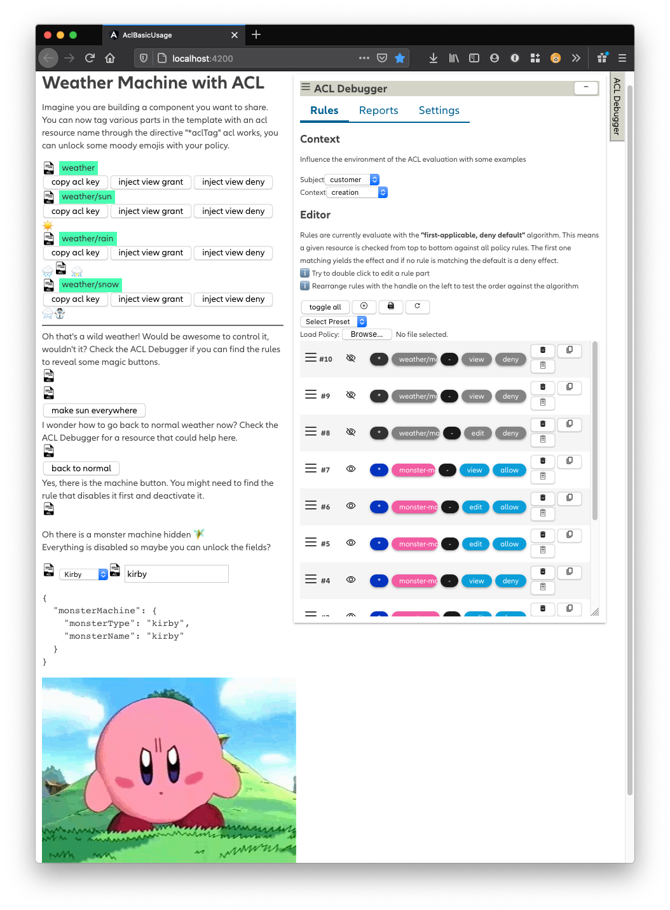

# Basic Usage of ACL

This is a staged example & content which will guide you through the ACL usage in the template and code. 

Based on [](https://github.developer.allianz.io/itmp-frontend/itmp-frontend-workspace/releases)


## Demonstration
There are two parts when you start the application:
 
+ Part 1 shows how you use the structural directive `*aclTag` to show & hide parts in the template. You can also see how to disable for example a button through a manual binding.

+ Part 2 shows how you can conveniently bind (which means reacting to ACL rules) a form to ACL with the `autoFormBindingFactory()` utility. 

The best way you can use this recipe is to start the Angular application, go through the application. Then read the sources (class & template) to get a better understanding of what's going on.

Please read the [ACL Guide](https://api-test.allianz.com/itmp-bb-library/my-viewer/guides/10-acl) to get a better understanding
of what ACL does in the Frontend.   

Let' start:

```
yarn install
yarn start
```


## How this was created

```
ng new acl-basic-usage --createApplication=true --skipGit=true --minimal=true --routing=false --style=scss
yarn ng add @allianz/ngx-ndbx
yarn add @itmp/acl
```

+ Injected the example policy content through `ACL_POLICY_CONTENT_TOKEN` in the `app.module.ts`
+ Imported the AclModule to allow the usage of the ACL directive and the acl debugger in the template
+ Then adjusted the AppComponent template & code to provide the staged recipe.

